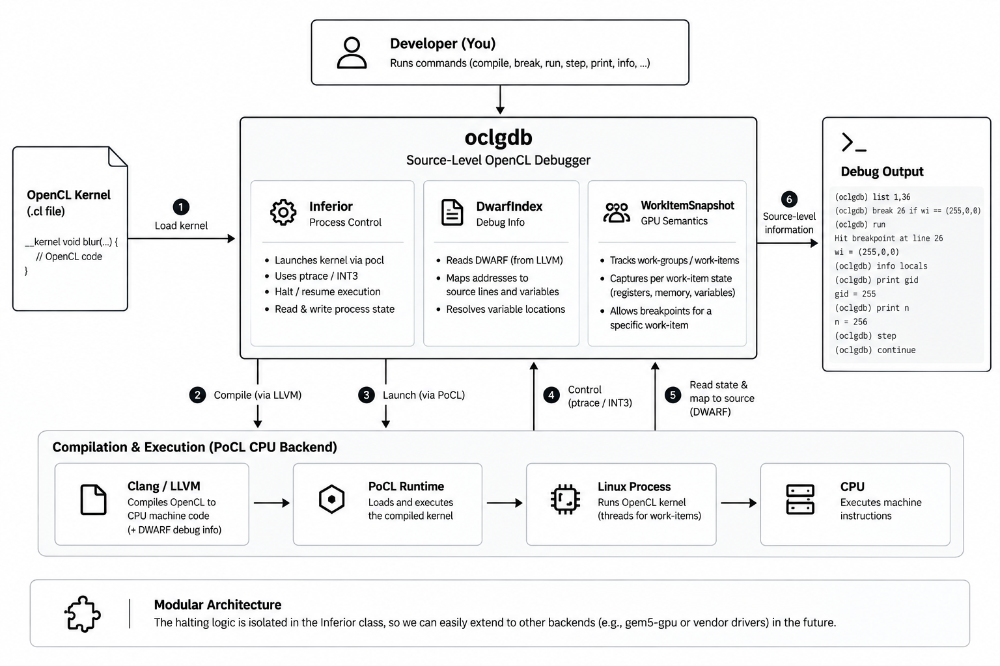
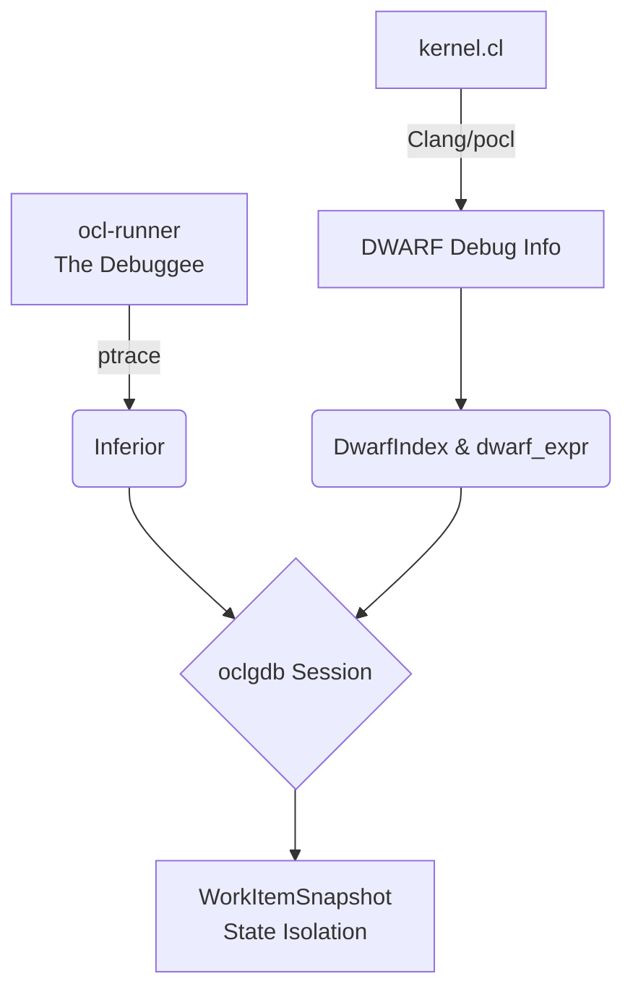

<div align="center">
  

  # oclgdb 
  **True Source-Level Debugging for OpenCL Kernels**

  [](#)
  [](#)
  [](#)
  [](#)
</div>

<br/>

> `oclgdb` brings the standard, interactive GDB debugging experience to OpenCL kernels. Say goodbye to `printf` and raw ISA reasoning. Set breakpoints, inspect local variables by name, and step through source code—all without requiring proprietary vendor driver hooks.

## 📖 Overview

Debugging OpenCL kernels running on GPUs is notoriously difficult. Production-grade GPU debuggers rely heavily on closed-source, vendor-gated driver APIs (e.g., NVIDIA's CUDBG). 

**`oclgdb` takes a radically open approach.** By targeting [pocl](http://portablecl.org/) (Portable Computing Language) running on its CPU device backend, we leverage LLVM's mature DWARF debug-info generation and standard OS-level halting mechanisms (`ptrace`). We deliver a fully functional, highly interactive debugger that faithfully models GPU execution semantics like work-items, work-groups, and divergence.

Built for **SegFault 2026 (Problem Statement P06)**. See [DECISIONS.md](DECISIONS.md) for technical rationale and [BUILD.md](BUILD.md) for build instructions.

---

## ✨ Key Features

- **Genuine Breakpoints:** Halt execution at specific source lines using physical `INT3` interrupts.
- **Granular Thread Filtering:** Set breakpoints conditionally based on exact work-item IDs (e.g., `break 26 if wi == (255,0,0)`).
- **Source-Level Variable Inspection:** Read OpenCL C variables using DWARF metadata—no need to decode raw registers.
- **True State Isolation:** Captures and isolates register files and variables for each individual work-item, overcoming the challenge of short-lived GPU registers.

---

## 🚀 Quick Start & Demo

Launch the Docker dev environment and run the flagship demo in under a minute.

```bash
# 1. Build the Docker image
docker build -f docker/Dockerfile -t oclgdb-dev:latest docker

# 2. Enter the environment and build the project
scripts/dev.sh bash -c "mkdir -p build && cd build && cmake -G Ninja .. && ninja"

# 3. Launch the debugger on our demo kernel
cd build
POCL_DEVICES=basic ./oclgdb --batch -x ../scripts/demo.txt ../kernels/blur3.ocl-run
```

---

## 🐛 The Anatomy of a Bug Catch

Our demo (`kernels/blur3.cl`) is a 3-point box blur over a 256-element signal. It contains a real, silent logic bug at the right-edge halo guard:

```c
if (lid == lsz - 1) {
    // BUG: Should be 'gid == n - 1'
    int right_src = (gid == n) ? n - 1 : gid + 1;   
    tile[lsz + 1] = in[right_src];
}
```

The guard evaluates `255 == 256`, falls through to the unclamped branch, and reads out of bounds. `oclgdb` catches this effortlessly:

1. Filter the breakpoint to the last work item: `break 26 if wi == (255,0,0)`
2. `run` to halt.
3. `print gid` (Outputs 255)
4. `print n` (Outputs 256)
5. `print gid == n` (Outputs false)

Root cause diagnosed instantly from source-level state.

---

## 🏗 Architecture Under the Hood

`oclgdb` is built with clear isolation boundaries to ensure future extensibility.



- **Inferior:** The only halting-specific code (`ptrace(2)` / `INT3`).
- **DwarfIndex & dwarf_expr:** Pure DWARF evaluation (LLVM wrapper). Needs no OpenCL specific knowledge.
- **WorkItemSnapshot:** Calibrates identity and isolates register files to model SIMT threads accurately.

---

## 🔮 Extensibility & Roadmap

The architecture was intentionally designed as a stepping stone toward a real GPU debug backend. The hardest part of GPU debugging—driver-level halting—is abstracted entirely into the `Inferior` class. 

To port `oclgdb` to a real GPU or simulator (like `gem5-gpu` or RISC-V GPGPU), one simply needs to swap out `Inferior` to interact with the target's JTAG/simulator hooks. The DWARF parsing and work-item logic remain completely untouched. See [STRETCH-GPU-SIMULATOR.md](docs/STRETCH-GPU-SIMULATOR.md) for our proof-of-concept sketch.

---

## 📁 Repository Structure

| Path | Description |
|---|---|
| `src/` | Core debugger source code |
| `host/` | The `ocl_runner` debuggee harness |
| `kernels/` | Demo OpenCL kernels and `.ocl-run` launch specs |
| `tests/` | End-to-end `ctest` regression suite (Real ptrace + pocl) |
| `docs/` | Phase 0 research, findings, and architectural documentation |
| `docker/` | Containerized build/runtime environment |

<br/>
<div align="center">
  <sub>Built with ❤️ by Team SegFault</sub>
</div>
